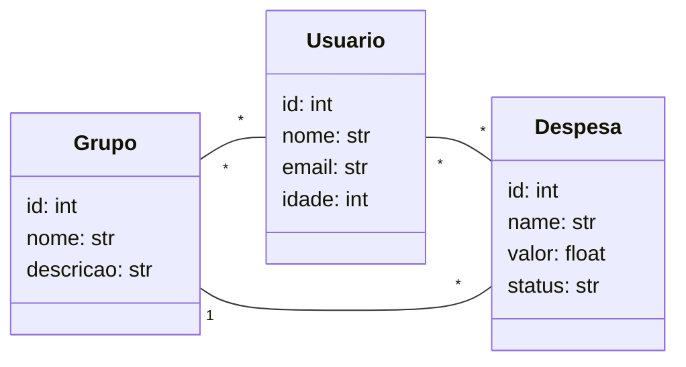

# Aplicação de Despesas

## Diagrama de Classes UML

```mermaid
classDiagram
    direction RL
    class Despesa {
        id: int
        name: str
        valor: float
        status: str
    }
    class Grupo {
        id: int
        nome: str
        descricao: str
    }
    class Usuario {
        id: int
        nome: str
        email: str
        idade: int
    }
    

    Usuario "*"-- "*" Grupo
    Grupo "1" -- "*" Despesa
    Despesa "*" -- "*" Usuario
    
```
